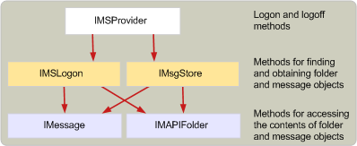

# Structure of Message Store Providers

 **Last modified:** July 23, 2011 
  
 * **Applies to:** Outlook * 
  
A message store provider, when it is running in memory, is an [IMSProvider : IUnknown](imsprovideriunknown.md) interface. The **IMSProvider** interface allows client applications and the MAPI spooler to log on to and off of the message store. The interfaces that client applications and the MAPI spooler use to access folders and messages in the message store are [IMSLogon](imslogoniunknown.md) and [IMsgStore](imsgstoreimapiprop.md) interfaces. These interfaces are typically created when the message store is first logged on to, although the [MSProviderInit](msproviderinit.md) entry point of the message store DLL could also create them. 
  
Because the **IMSLogon** and **IMsgStore** interfaces share some methods, it may be easier to create one class object that inherits from both of these interfaces. You can also implement these interfaces in separate objects, and write helper functions internal to your DLL that implement the shared methods that can then be called from the methods in the **IMSLogon** and **IMsgStore** interfaces. 
  
The following illustration shows a high-level outline of the object hierarchy within a running message store.
  
 **Message store object hierarchy**
  

  
## See also

#### Concepts

[Developing a MAPI Message Store Provider](developing-a-mapi-message-store-provider.md)

